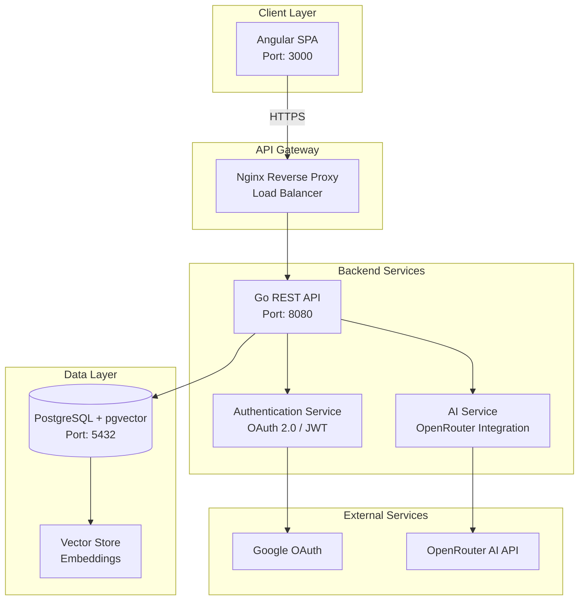

# Resume.in 📄✨

<p align="center">
  
  
  
</p>

<p align="center">A modern, AI-powered web application for creating and managing professional resumes with ATS optimization.</p>

## ✨ Features

- 🤖 AI-powered resume generation based on chat conversations
- 📊 ATS optimization to help your resume pass applicant tracking systems
- 📱 Responsive web interface built with Angular
- 🔒 Secure API built with Go and Gin framework
- 🗃️ Persistent data storage with PostgreSQL and pgvector
- 🔄 Real-time updates and instant preview
- 📤 Export to PDF format
- 🔐 OAuth 2.0 authentication with Google SSO

## 🏗️ System Architecture

### Overview

Resume.in follows a modern microservices architecture with a clear separation between frontend, backend, and data storage layers. The system is designed for scalability, security, and maintainability.



### Technology Stack

#### Frontend
- **Framework**: Angular 19.2
- **Styling**: Tailwind CSS 4.1
- **State Management**: RxJS
- **Authentication**: JWT with HTTP Interceptors
- **Build Tool**: Angular CLI with Vite

#### Backend
- **Language**: Go 1.21+
- **Framework**: Gin Web Framework
- **Authentication**: OAuth 2.0 (Google) + JWT
- **API Documentation**: Swagger/OpenAPI
- **Database ORM**: sqlx
- **Vector Operations**: pgvector

#### Database
- **Primary Database**: PostgreSQL 14
- **Vector Extension**: pgvector for AI embeddings
- **Session Management**: Database-backed sessions

#### Infrastructure
- **Containerization**: Docker & Docker Compose
- **Reverse Proxy**: Nginx
- **API Gateway**: Built-in CORS and rate limiting

### Component Architecture

```
┌─────────────────────────────────────────────────────────────┐
│                        Frontend (Angular)                     │
├─────────────────────────────────────────────────────────────┤
│  Components │  Services  │  Guards   │  Interceptors        │
│  ├── Auth   │  ├── Auth  │  ├── Auth │  ├── Auth           │
│  ├── Resume │  ├── API   │  └── Role │  └── Error          │
│  └── Chat   │  └── Chat  │           │                      │
└─────────────────────────────────────────────────────────────┘
                               │
                               ▼
┌─────────────────────────────────────────────────────────────┐
│                      Backend API (Go/Gin)                    │
├─────────────────────────────────────────────────────────────┤
│  Controllers  │  Services    │  Middleware  │  Models       │
│  ├── Auth     │  ├── OAuth   │  ├── Auth    │  ├── User    │
│  ├── Resume   │  ├── JWT     │  ├── CORS    │  ├── Resume  │
│  └── Chat     │  └── AI      │  └── Logger  │  └── Chat    │
└─────────────────────────────────────────────────────────────┘
                               │
                               ▼
┌─────────────────────────────────────────────────────────────┐
│                    Data Layer (PostgreSQL)                   │
├─────────────────────────────────────────────────────────────┤
│  Tables        │  Indexes      │  Extensions               │
│  ├── users     │  ├── Primary  │  ├── pgvector            │
│  ├── resumes   │  ├── Foreign  │  └── uuid-ossp          │
│  ├── messages  │  └── Vector   │                          │
│  └── documents │               │                          │
└─────────────────────────────────────────────────────────────┘
```

### Data Flow

1. **Authentication Flow**
   ```
   User → Angular App → Google OAuth → Backend API → JWT Generation → Secured Access
   ```

2. **Resume Generation Flow**
   ```
   User Input → Chat Interface → AI Processing → Vector Storage → Resume Generation → PDF Export
   ```

3. **API Request Flow**
   ```
   Angular App → HTTP Request → Auth Interceptor → Backend API → Database → Response
   ```

### Security Architecture

- **Authentication**: OAuth 2.0 with Google provider
- **Authorization**: JWT tokens with role-based access control
- **API Security**: 
  - CORS configuration
  - Rate limiting
  - Request validation
  - SQL injection prevention
- **Data Security**:
  - Encrypted passwords (bcrypt)
  - Secure session management
  - HTTPS enforcement in production

### Deployment Architecture

#### Development Environment
```yaml
Services:
  - Frontend: http://localhost:3000 (Angular Dev Server)
  - Backend: http://localhost:8080 (Go API)
  - Database: localhost:5432 (PostgreSQL)
```

#### Production Environment
```yaml
Services:
  - Frontend: Nginx serving static files
  - Backend: Go binary with clustering
  - Database: PostgreSQL with replication
  - Load Balancer: Nginx/HAProxy
  - SSL: Let's Encrypt certificates
```

### API Design Principles

1. **RESTful Design**: Following REST conventions for resource management
2. **Versioning**: API versioning through URL path (/api/v1)
3. **Error Handling**: Consistent error response format
4. **Documentation**: OpenAPI/Swagger specification
5. **Rate Limiting**: Token bucket algorithm for API throttling

### Database Schema

Key tables and relationships:
- **users**: OAuth profiles and authentication data
- **resumes**: Resume metadata and content
- **chat_messages**: Conversation history with embeddings
- **documents**: Vector store for AI context retrieval

## 🚀 Getting Started

### Prerequisites

- [Docker](https://docs.docker.com/get-docker/)
- [Docker Compose](https://docs.docker.com/compose/install/)
- An OpenRouter API key for AI capabilities
- Google OAuth credentials (see OAuth Setup below)

### OAuth Setup

1. Go to [Google Cloud Console](https://console.cloud.google.com/)
2. Create a new project or select an existing one
3. Enable the Google+ API
4. Go to "Credentials" and create OAuth 2.0 Client ID
5. Set up the OAuth consent screen
6. Add authorized redirect URIs:
   - `http://localhost:8080/api/auth/google/callback` (for local development)
   - Your production domain callback URL
7. Copy your Client ID and Client Secret

### Environment Variables

Create a `.env` file in the root directory with the following variables:

```env
# OpenRouter API
OPEN_ROUTER_API_KEY=your_openrouter_api_key
OPEN_ROUTER_MODEL=anthropic/claude-3-sonnet:beta

# Google OAuth
GOOGLE_CLIENT_ID=your_google_client_id
GOOGLE_CLIENT_SECRET=your_google_client_secret
GOOGLE_REDIRECT_URL=http://localhost:8080/api/auth/google/callback

# JWT Secret (change this in production)
JWT_SECRET=your-secret-key-change-in-production

# Frontend URL
FRONTEND_URL=http://localhost:3000
```

### Using Scripts

#### On Linux/Mac:

1. Make the scripts executable:
   ```bash
   chmod +x start.sh stop.sh
   ```

2. Start the application:
   ```bash
   ./start.sh
   ```

3. Stop the application:
   ```bash
   ./stop.sh
   ```

#### On Windows:

1. Start the application:
   ```
   start.bat
   ```

2. Stop the application:
   ```
   stop.bat
   ```

### Manual Commands

1. Build and start the containers:
   ```bash
   docker-compose up --build
   ```

2. Stop the containers:
   ```bash
   docker-compose down
   ```

## 🔗 Accessing the Application

- Frontend: http://localhost:3000
- Backend API: http://localhost:8080/api
- Health Check: http://localhost:8080/health
- **Swagger UI**: http://localhost:8080/swagger/index.html

## 📚 API Documentation

Comprehensive API documentation is available in two formats:

1. **Interactive Swagger UI**: Access the interactive API documentation at http://localhost:8080/swagger/index.html
2. **Markdown Documentation**: See [backend/API_DOCUMENTATION.md](backend/API_DOCUMENTATION.md) for detailed endpoint descriptions

The API includes the following main sections:
- **Authentication** (OAuth 2.0 with Google SSO)
- **Resume Management** (CRUD operations)
- **AI Chatbot** (Conversation and resume generation)
- **Document Management** (Vector store for context)

All protected endpoints require JWT authentication using the Bearer scheme.

## 📚 API Endpoints

| Method | Endpoint | Description |
|--------|----------|-------------|
| GET | `/api/auth/google/login` | Initiate Google OAuth login |
| GET | `/api/auth/google/callback` | Handle OAuth callback |
| POST | `/api/auth/refresh` | Refresh JWT token |
| POST | `/api/auth/logout` | Logout user (requires auth) |
| GET | `/api/auth/profile` | Get user profile (requires auth) |
| GET | `/api/resume` | Get all resumes (requires auth) |
| GET | `/api/resume/:id` | Get a resume by ID (requires auth) |
| POST | `/api/resume` | Create a new resume (requires auth) |
| PUT | `/api/resume/:id` | Update a resume (requires auth) |
| DELETE | `/api/resume/:id` | Delete a resume (requires auth) |
| GET | `/api/skills` | Get all skills (requires auth) |
| GET | `/api/experience` | Get all experiences (requires auth) |
| POST | `/api/chat/message` | Send a message to the chatbot (requires auth) |
| GET | `/api/chat/history/:sessionId` | Get chat history (requires auth) |
| POST | `/api/chat/generate-resume` | Generate a resume from chat history (requires auth) |

## 📁 Project Structure

```
resume.in/
├── backend/              # Go backend
│   ├── config/           # Configuration
│   ├── controllers/      # HTTP handlers
│   ├── middleware/       # Middleware
│   ├── models/           # Data models
│   ├── routes/           # API routes
│   ├── utils/            # Utilities
│   └── test/             # Test files and output
├── client/               # Angular frontend
│   ├── src/              # Source code
│   │   ├── app/          # Application components
│   │   │   ├── auth/     # Authentication components
│   │   │   ├── guards/   # Route guards
│   │   │   ├── interceptors/ # HTTP interceptors
│   │   │   └── services/ # Services
│   │   └── ...
│   └── ...
├── docker-compose.yml    # Docker Compose configuration
├── .env                  # Environment variables (create this)
├── start.sh              # Script to start the application (Linux/Mac)
├── stop.sh               # Script to stop the application (Linux/Mac)
├── start.bat             # Script to start the application (Windows)
└── stop.bat              # Script to stop the application (Windows)
```

## 💻 Development

### Backend

To run the backend locally for development:

```bash
cd backend
go run main.go
```

### Frontend

To run the frontend locally for development:

```bash
cd client
npm install
npm start
```

## 🔒 Security Notes

1. **JWT Secret**: Make sure to change the default JWT secret in production
2. **OAuth Credentials**: Keep your Google OAuth credentials secure and never commit them to version control
3. **CORS**: Update the `ALLOW_ORIGINS` environment variable in production to only allow your domain
4. **HTTPS**: Use HTTPS in production for secure OAuth flow

## 🤝 Contributing

Contributions are what make the open source community such an amazing place to learn, inspire, and create. Any contributions you make are **greatly appreciated**.

1. Fork the Project
2. Create your Feature Branch (`git checkout -b feature/AmazingFeature`)
3. Commit your Changes (`git commit -m 'Add some AmazingFeature'`)
4. Push to the Branch (`git push origin feature/AmazingFeature`)
5. Open a Pull Request

Please make sure to update tests as appropriate and adhere to the existing coding style.

## 📝 License

This project is licensed under the MIT License - see the [LICENSE](LICENSE) file for details.

## 🙏 Acknowledgments

- [Gin Framework](https://github.com/gin-gonic/gin) for the Go web framework
- [Angular](https://angular.io/) for the frontend framework
- [pgvector](https://github.com/pgvector/pgvector) for vector similarity search in PostgreSQL
- [OpenRouter](https://openrouter.ai/) for providing AI capabilities

## 📧 Contact

If you have any questions or suggestions, please open an issue or reach out to the maintainers.
